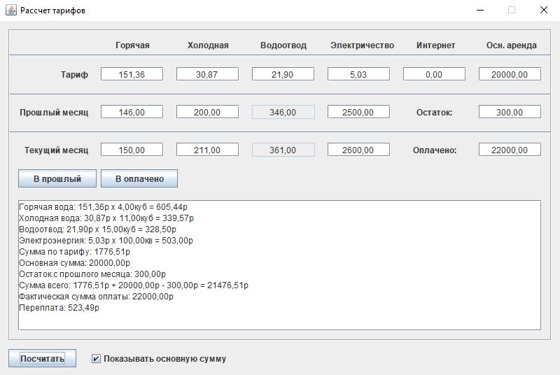
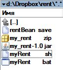

# my_rent
Когда устал ежемесячно считать потребление счетчиков для квартиры в аренде

Архив для скачивания: 

## Как пользоваться:
Заполняете показатели, нажимаете "Посчитать". Все рассчеты попадают в поле вывода. 

В момент нажатия кнопки "Посчитать" все данные сохраняются в файле rentBean.save. 

При наступлении очередного месяца запускаете программу, нажимаете "В прошлый" и все показатели текущего месяца переносятся в поля прошлого месяца.
Теперь можно заполнить поля текущего месяца новыми значениями и выполнить очередной рассчет.

Удобнее всего хранить приложение в Dropbox или на Яндекс диске:

Для запуска пользуйтесь стартовыми скриптами: myRent.bat (Windows), myRent.sh (Linux).

Лицензия: Apache-2.0
